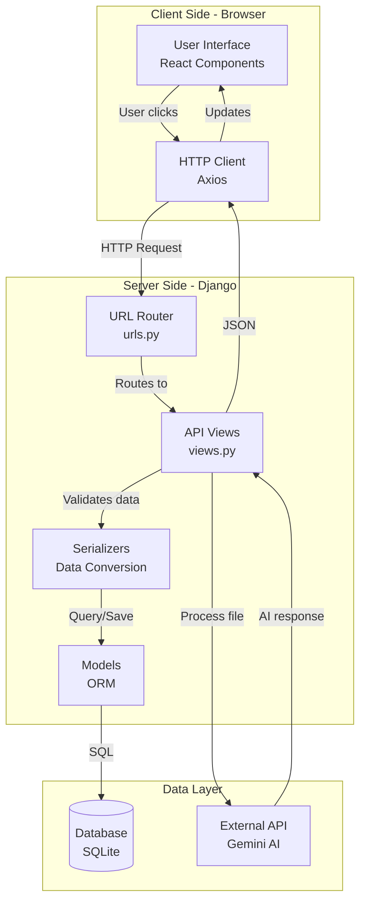
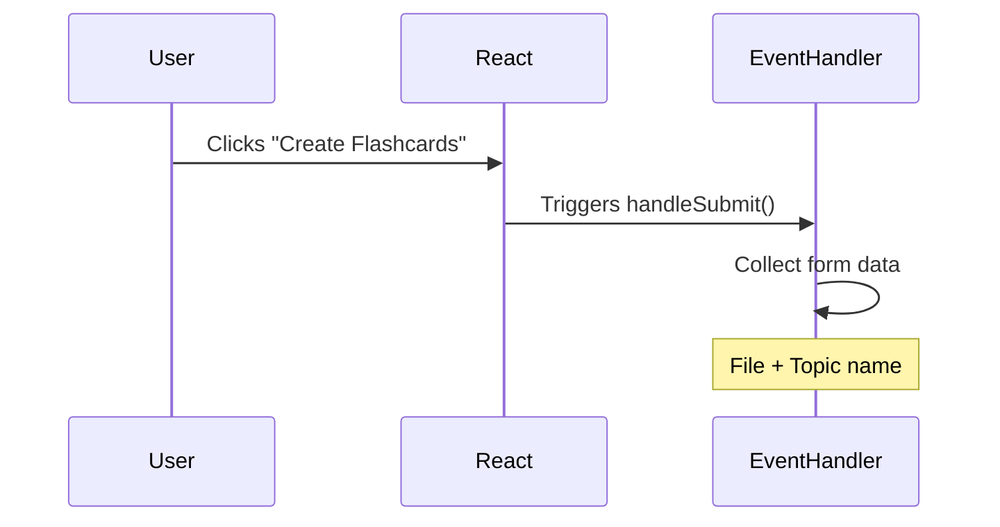
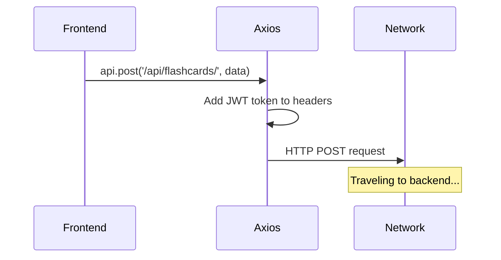
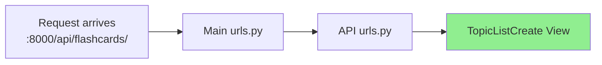
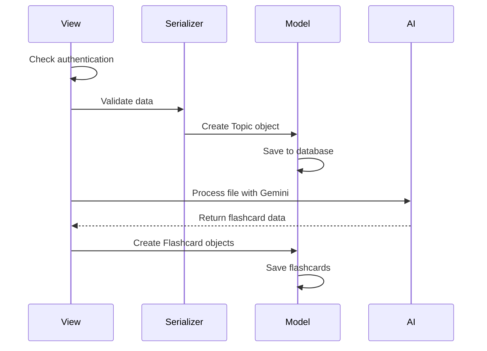
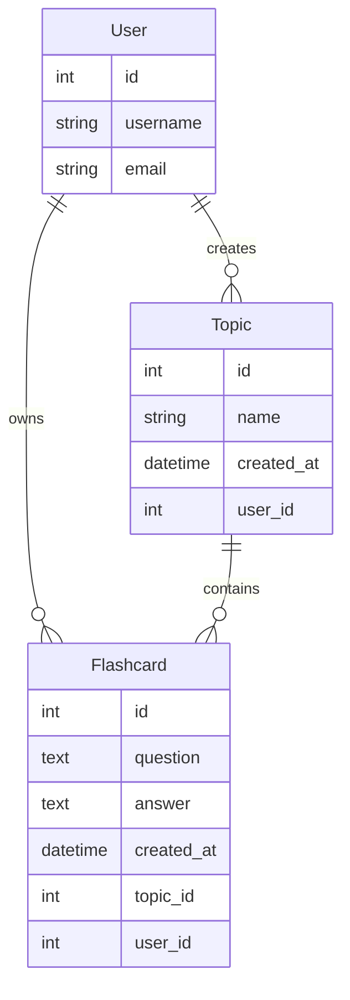
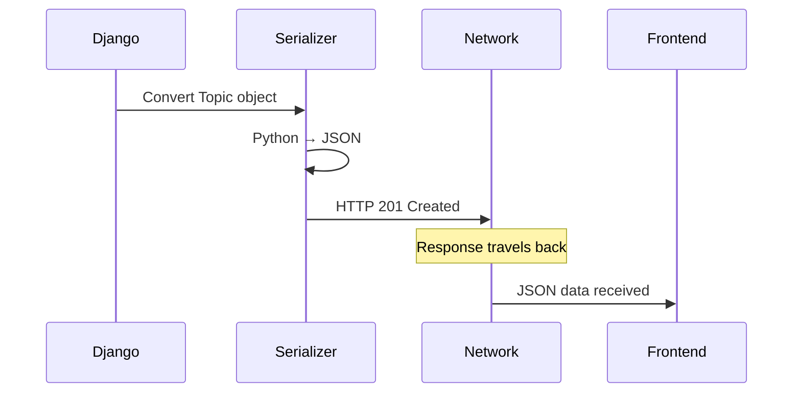
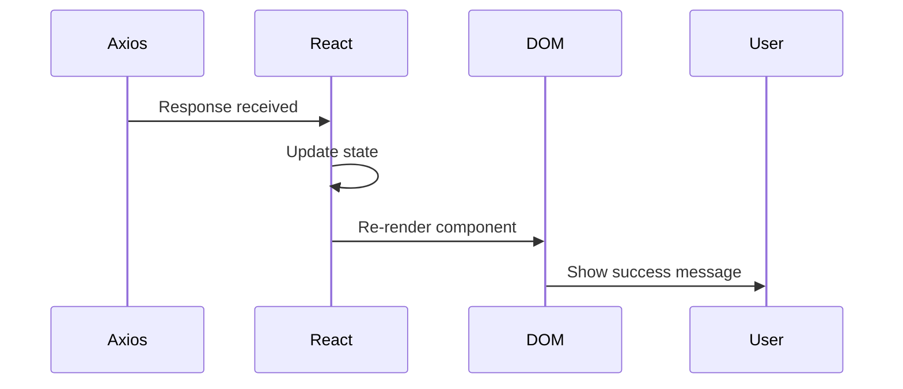
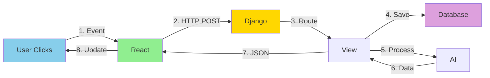
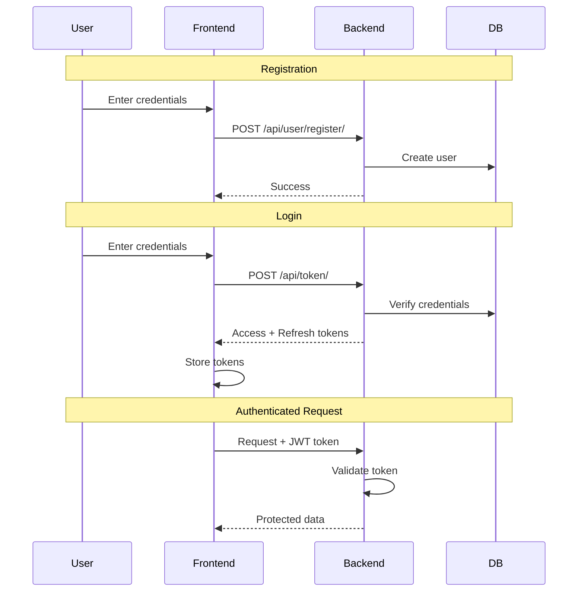

# Help2Study - System Architecture

This document explains how Help2Study works under the hood, with diagrams showing how data flows through the system.

> **📊 Note on Diagrams:** The diagrams in this document use Mermaid syntax, which **automatically renders as visual diagrams on GitHub**. No extension needed! If you're viewing locally in a text editor, you'll see the code - view this file on GitHub to see the rendered diagrams.

---

## System Overview



---

## The Complete Request Journey

Let's trace what happens when a user uploads a document to create flashcards.

### Step 1: User Action (Frontend)

**File:** `frontend/src/components/FileUploadForm.jsx`



**What happens:**
- User fills form and clicks submit
- React event handler captures the click
- Form data (file + topic name) is collected
- Ready to send to backend

**Key concepts:** Event Handling, Form Data, User Interface

---

### Step 2: The API Request

**File:** `frontend/src/api.js`



**What happens:**
- Axios prepares an HTTP POST request
- JWT token added to Authorization header
- Request body contains file and topic name
- Sent to `http://localhost:8000/api/flashcards/`

**Key concepts:** HTTP Request, HTTP Method (POST), Authentication (JWT), Endpoint

---

### Step 3: Backend Routing

**Files:** `backend/backend/urls.py` → `backend/api/urls.py`



**What happens:**
- Django receives request on port 8000
- Main `urls.py` routes `/api/` to the api app
- API `urls.py` matches `/flashcards/` pattern
- Request directed to `TopicListCreate` view

**Key concepts:** Routing, URL Patterns, Server

---

### Step 4: View Processing

**File:** `backend/api/views.py:20-36`



**What happens:**
1. View checks if user is authenticated (JWT token)
2. Serializer validates the incoming data
3. Topic model instance created and saved
4. File extracted and sent to Gemini AI
5. AI returns flashcard questions/answers
6. Multiple Flashcard objects created and saved
7. Response prepared

**Key concepts:** View, Permissions, Validation, ORM, CRUD Operations

---

### Step 5: Database Operations

**File:** `backend/api/models.py`



**What happens:**
- Django ORM translates Python to SQL
- `Topic.objects.create()` → `INSERT INTO topics...`
- `Flashcard.objects.filter()` → `SELECT * FROM flashcards WHERE...`
- No raw SQL needed

**Key concepts:** Models, ORM, Foreign Keys, Database Relationships

---

### Step 6: Response Returned

**File:** `backend/api/serializers.py`



**What happens:**
- Serializer converts Python objects to JSON
- HTTP response created with status code 201 (Created)
- Response includes the new topic data
- Sent back through the network

**Key concepts:** Serialization, HTTP Response, Status Codes, JSON

---

### Step 7: UI Update

**File:** `frontend/src/components/FileUploadForm.jsx`



**What happens:**
- Axios receives the response
- React component state updated
- Component re-renders automatically
- User sees confirmation message
- New flashcards appear in the UI

**Key concepts:** Asynchronous JavaScript, State Management, Component Re-rendering

---

## Request/Response Summary



**The full cycle:**
1. User action triggers event
2. HTTP request sent
3. Backend routes to handler
4. Data saved to database
5. External API called (optional)
6. Response prepared
7. JSON sent back
8. UI updates

---

## Technology Layers

### Frontend Stack
```
User Interface
      ↓
React Components (JSX)
      ↓
React Router (Navigation)
      ↓
Axios (HTTP Client)
      ↓
HTTP Request → Backend
```

### Backend Stack
```
HTTP Request arrives
      ↓
Django URL Router
      ↓
View (Request Handler)
      ↓
Serializer (Validation)
      ↓
Model (ORM)
      ↓
Database (SQL)
```

---

## Authentication Flow



**How JWT works:**
1. User logs in with username/password
2. Backend validates and returns JWT tokens
3. Frontend stores tokens (localStorage)
4. Every request includes token in Authorization header
5. Backend validates token before processing

---

## File References

Here's where to find each piece in the codebase:

**Frontend:**
- Entry point: `frontend/src/main.jsx`
- Routing: `frontend/src/App.jsx`
- File upload: `frontend/src/components/FileUploadForm.jsx`
- API client: `frontend/src/api.js`

**Backend:**
- Main settings: `backend/backend/settings.py`
- URL routing: `backend/backend/urls.py` → `backend/api/urls.py`
- Request handlers: `backend/api/views.py`
- Database models: `backend/api/models.py`
- Data serialization: `backend/api/serializers.py`
- AI integration: `backend/api/geminiapi.py`

---

## Key Takeaways

✅ **Separation of concerns:** Frontend, backend, and database each have clear responsibilities

✅ **Request/response cycle:** All web interactions follow this pattern

✅ **RESTful design:** Endpoints use standard HTTP methods (GET, POST, DELETE)

✅ **Authentication:** JWT tokens secure API endpoints

✅ **ORM abstraction:** Django handles database operations without SQL

✅ **State management:** React automatically updates UI when data changes

---

## Next Steps

**To understand the code:**
1. Read through `views.py` to see request handlers
2. Check `models.py` to see database structure
3. Look at `FileUploadForm.jsx` to see how requests start
4. Trace a request through the system using browser DevTools

**To modify the system:**
1. Add new model → Run migrations
2. Create new view → Add URL route
3. Build frontend component → Connect to API
4. Test with browser Network tab

**See [CONCEPTS_GUIDE.md](CONCEPTS_GUIDE.md) for term definitions and learning resources**
